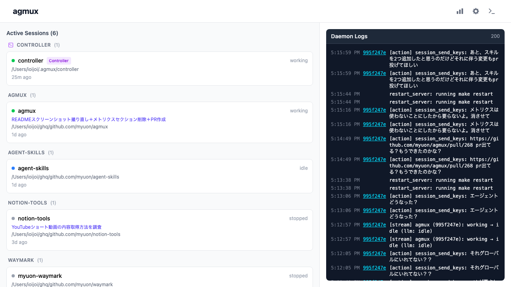
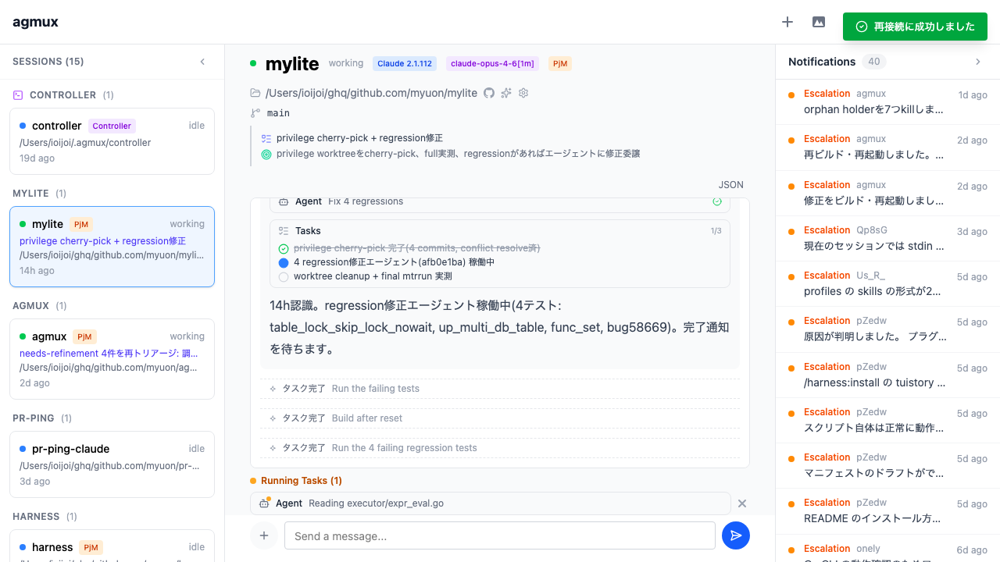

# agmux — AI Agent Multiplexer

複数のClaude Codeセッションを同時に実行・監視・制御するための統合管理ツール。
1つのWebダッシュボードから、ローカルPC上で動いているすべてのagentの状態を把握し、介入できます。

## スクリーンショット

### ダッシュボード



### セッション詳細 (Stream Mode)



## 主な機能

- **セッション管理** — Web UIまたはCLIからClaude Codeセッションを作成・停止・削除
- **リアルタイム監視** — WebSocketで全セッションの状態をリアルタイムに一覧表示
- **自動巡回デーモン** — 各セッションを定期巡回し、承認待ちやエラーを検知して自律的に対応
- **Stream Mode** — Claude CLIのstream-json出力をパース・表示し、ツール呼び出しの詳細まで確認可能
- **Controllerセッション** — agmux自体をClaude Codeで操作するための特別なセッション

## 技術スタック

| カテゴリ | 選定 |
|---------|------|
| バックエンド | Go (chi, cobra, gorilla/websocket, SQLite) |
| フロントエンド | TypeScript + React + Vite + Tailwind CSS |
| ビルド | Go embed でsingle binaryにビルド |

## インストール

[GitHub Releases](https://github.com/myuon/agmux/releases) からビルド済みバイナリをダウンロードできます。

```bash
# macOS (Apple Silicon)
curl -L -o agmux https://github.com/myuon/agmux/releases/latest/download/agmux-darwin-arm64
chmod +x agmux
mv agmux ~/.local/bin/

# macOS (Intel)
curl -L -o agmux https://github.com/myuon/agmux/releases/latest/download/agmux-darwin-amd64
chmod +x agmux
mv agmux ~/.local/bin/

# Linux (amd64)
curl -L -o agmux https://github.com/myuon/agmux/releases/latest/download/agmux-linux-amd64
chmod +x agmux
mv agmux ~/.local/bin/
```

> `~/.local/bin/` が PATH に含まれていない場合は、シェルの設定ファイルに `export PATH="$HOME/.local/bin:$PATH"` を追加してください。システムワイドにインストールする場合は `sudo mv agmux /usr/local/bin/` を使用してください。

### ソースからビルド

```bash
git clone https://github.com/myuon/agmux.git
cd agmux
make build    # frontend + go build → ./agmux バイナリ生成
make install  # $GOPATH/bin にインストール
```

## 使い方

### サーバー起動

```bash
agmux serve              # デーモン + Web UIを起動 (デフォルト: http://localhost:4321)
agmux serve -p 8080      # ポート指定
```

ブラウザで `http://localhost:4321` を開くとダッシュボードが表示されます。

### CLI

```bash
agmux session list                          # セッション一覧
agmux session create <name> -p <path>       # セッション作成
agmux session create <name> -p <path> -m "prompt"  # 初期プロンプト付き
agmux session send <id> "message"           # メッセージ送信
agmux session stop <id>                     # 停止
agmux session delete <id>                   # 削除
```

## 設定

設定ファイルは `~/.agmux/config.toml` に保存されます。Web UIの設定画面からも変更可能です。

```toml
[server]
port = 4321

[daemon]
interval = "30s"

[claude]
permission_mode = "auto"  # default, acceptEdits, plan, dontAsk, bypassPermissions, auto
```

## Codexセッションのセットアップ

agmuxはOpenAI Codex CLIのセッションもサポートしています。CodexセッションでagmuxのMCPツール（ゴール管理、escalate等）を利用するには、事前にグローバルMCP登録が必要です。

```bash
codex mcp add agmux -- agmux mcp
```

セッション固有の情報（セッションID等）は環境変数経由で自動的に渡されます。

## Controllerセッション

agmuxはController用の特別なセッションを自動的に起動します。ControllerセッションにClaude Code用のスキルをインストールすると、Controllerから他のセッションを操作できます。

```bash
npx skills add myuon/agmux --skill agmux -y
```

## おすすめの使い方

### Controllerから操作するワークフロー

agmuxの基本的な使い方として、**Controllerセッションを起点にすべてを操作する**パターンをおすすめします。

1. `agmux serve` でサーバーを起動
2. 自動的に立ち上がるControllerセッションにスキルをインストール（`npx skills add myuon/agmux --skill agmux -y`）
3. Controllerセッションに対して指示を出し、ワーカーセッションを作成・管理する
4. ツールのインストールなど環境セットアップもControllerから行う

Controllerが司令塔となり、複数のワーカーセッションに作業を振り分けることで、並列に効率よくタスクを進められます。

### リモートアクセス（Tailscale経由）

agmuxはWeb UIを提供するため、スマホやタブレットからリモートで操作することも可能です。外出先からセッションの状態を確認したり、指示を送ったりできます。

リモートアクセスには **Tailscale** などのVPNを利用してください。

```bash
# Tailscaleをインストール・セットアップした上で
agmux serve  # ローカルで起動

# 同じTailscaleネットワーク内の端末から
# http://<tailscale-ip>:4321 でアクセス
```

> **警告**: agmuxを直接インターネットに公開するのは絶対にやめてください。認証機能がないため、誰でもセッションを操作できてしまいます。必ずTailscale等のVPN経由でアクセスしてください。

## 開発

```bash
make dev      # フロントエンドdev server + Go run (ホットリロード)
make test     # go test ./...
make build    # プロダクションビルド
```

## ライセンス

MIT
